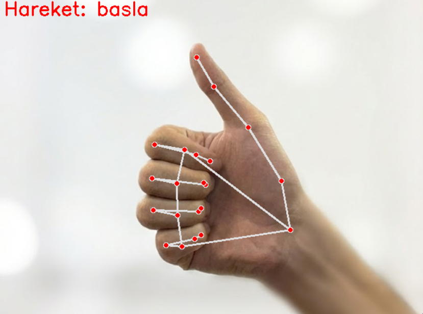
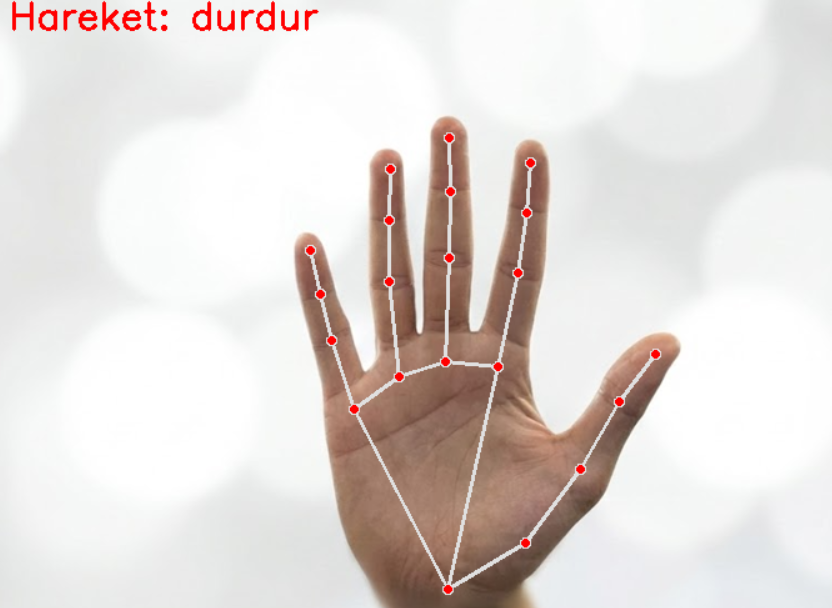
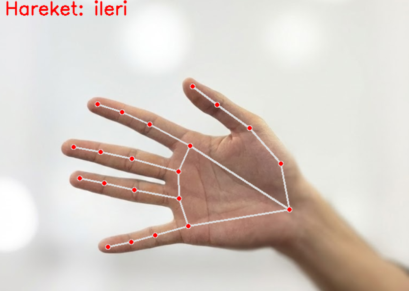
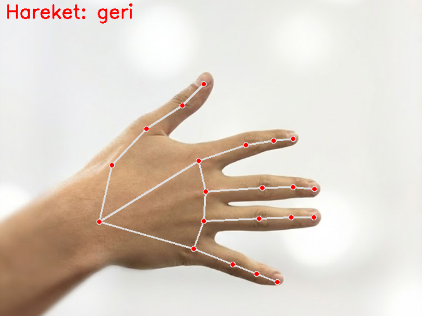

# hand_gesture_video_control
hand_gesture_video_control, bilgisayarla görme ve makine öğrenmesi tekniklerini kullanarak videoları el hareketleriyle kontrol etmenizi sağlayan bir Python projesidir. Gerçek zamanlı kamera görüntüsü üzerinden el hareketlerini algılar ve önceden tanımlanmış hareketlere göre videoyu oynatır, durdurur, ileri veya geri sarar. Böylece videoları tamamen el hareketlerinizle, dokunmaya gerek kalmadan kontrol edebilirsiniz.

## Proje Yapısı
/                     
|-- data/           
|-- dist/proje_run.exe             
|-- frame_processing/  
|-- ornek_video/       
|-- model_training.ipynb  
|-- logistic_model.pkl  
|-- scaler_model.pkl    
|-- proje_run.py         
|-- requirements.txt     
|-- .gitignore   
|-- .gitattributes   

## Kurulum ve Çalıştırma

Bu projeyi çalıştırmanın iki yolu vardır:  

### 1️⃣ Kaynak kodu üzerinden (Python ile)
1. Repoyu klonlayın: `git clone https://github.com/EmirhanEmir/hand_gesture_video_control.git && cd hand_gesture_video_control`  
2. (Önerilen) Python 3.10 kullanarak sanal ortam oluşturun: `python -m venv venv && source venv/bin/activate  # Linux/macOS` veya `venv\Scripts\activate  # Windows`
3. Bağımlılıkları yükleyin: `pip install -r requirements.txt`   
4. Ana scripti çalıştırın: `python proje_run.py`  

### 2️⃣ Derlenmiş exe dosyası ile (Python yüklemeye gerek yok)
1. Repoyu indirin.  
2. `dist/` içindeki exe dosyasını çalıştırın.  
3. Dosya yapısını bozmadan çalıştırabilirsiniz; proje Python veya bağımlılıkları yüklemeden hazır şekilde çalışacaktır.

## Kullanım ve İşleyiş

Bu projede **4 farklı el hareketi** tanımlıdır ve her hareket belirli bir video kontrol komutunu tetikler.  
Sistem yalnızca **sağ el** ile yapılan jestleri algılar ve gerçek zamanlı kamera görüntüsü üzerinden işleme alır.

### Tanımlı El Hareketleri

#### **1️⃣ Okey İşareti – (Play)**
Videoyu **başlatmak** için sağ elinizle **okey işareti** yapıp kameraya gösterin.  

---

#### **2️⃣ Avuç Kameraya Dönük Dik – (Pause)**
Videoyu **duraklatmak** için sağ elinizi **avuç içi kameraya bakacak ve dik** şekilde gösterin.  

---

#### **3️⃣ Avuç Kameraya Dönük, El Yatay – (Forward)**
Videoyu **ileri sarmak** için sağ elinizi **avuç içi kameraya dönük ve yatay** biçimde tutun.  

---

#### **4️⃣ Avuç Size Dönük, El Yatay – (Backward)**
Videoyu **geri sarmak** için sağ elinizi **avuç içi size dönük ve yatay** şekilde konumlandırın.  

---

### Önemli Not  
Bu proje **yalnızca sağ el hareketlerini** algılar. Sol el ile yapılan hareketler sistem tarafından yanlış değerlendirilebilir.

## Gereksinimler
- Python 3.8-3.10 (sadece projeyi klonlayıp çalıştırmak isteyenler için gereklidir)  
- `requirements.txt` içindeki bağımlılıklar
- (İsteğe bağlı) Webcam veya video dosyası, gerçek zamanlı test yapmak isteyenler için

## Proje Amacı ve Öğrenilenler
Bu proje, video üzerinde el hareketi ile kontrol uygulamalarını keşfetmek için geliştirilmiştir.  
Projede şunlar öğrenilmiştir:  
- Video karelerinin işlenmesi  
- El hareketlerini sınıflandıran bir makine öğrenmesi modeli eğitimi (scikit-learn ile)  
- Modeli gerçek zamanlı kontrol döngüsüne entegre etme  
- Video girişi, hareket algılama ve kontrol mantığını bir araya getiren çalışan bir script oluşturma

